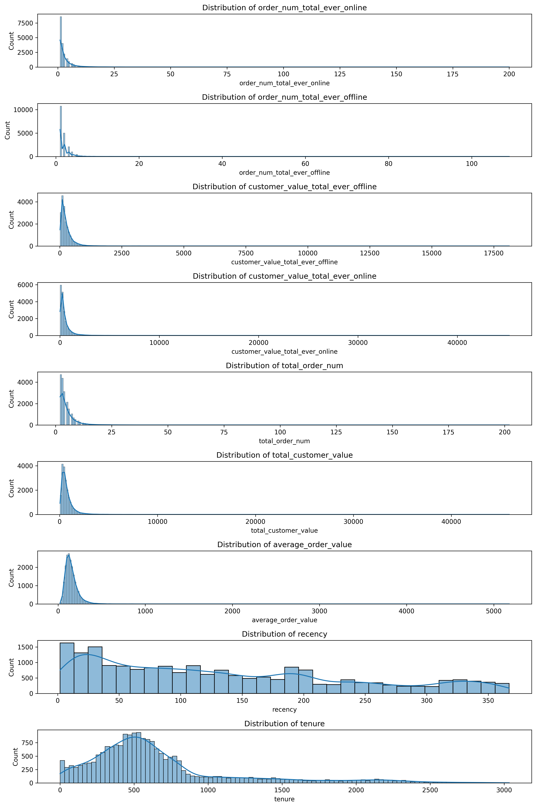
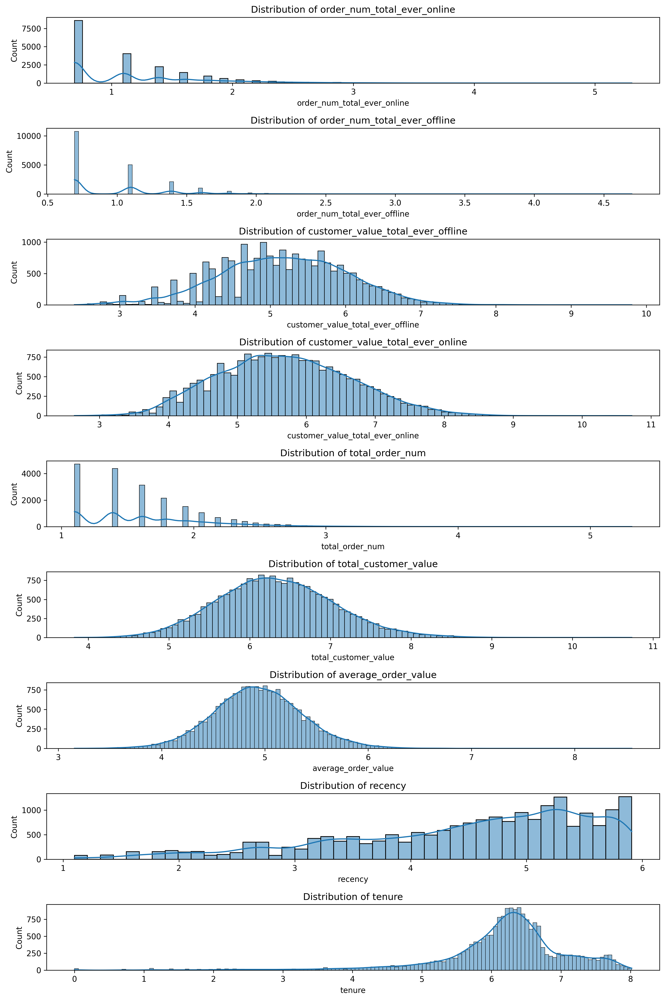
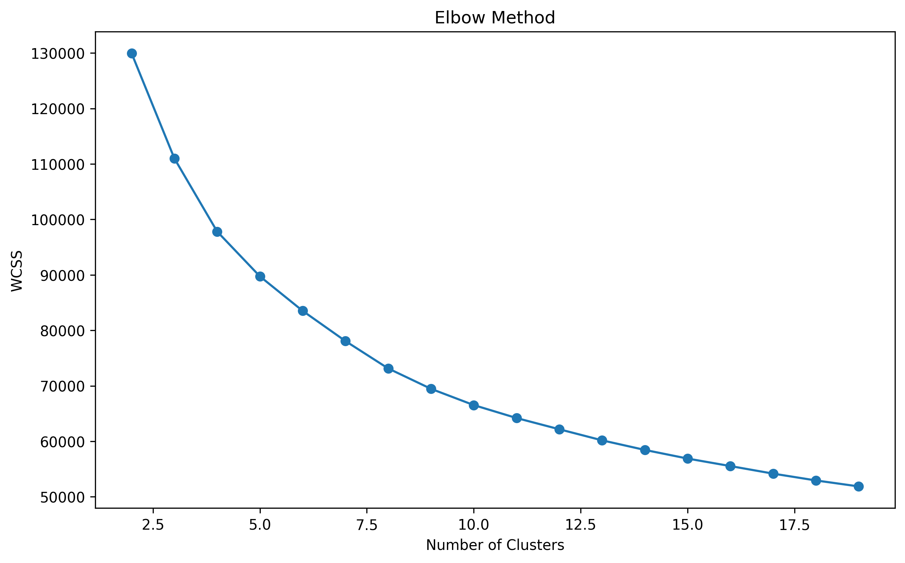
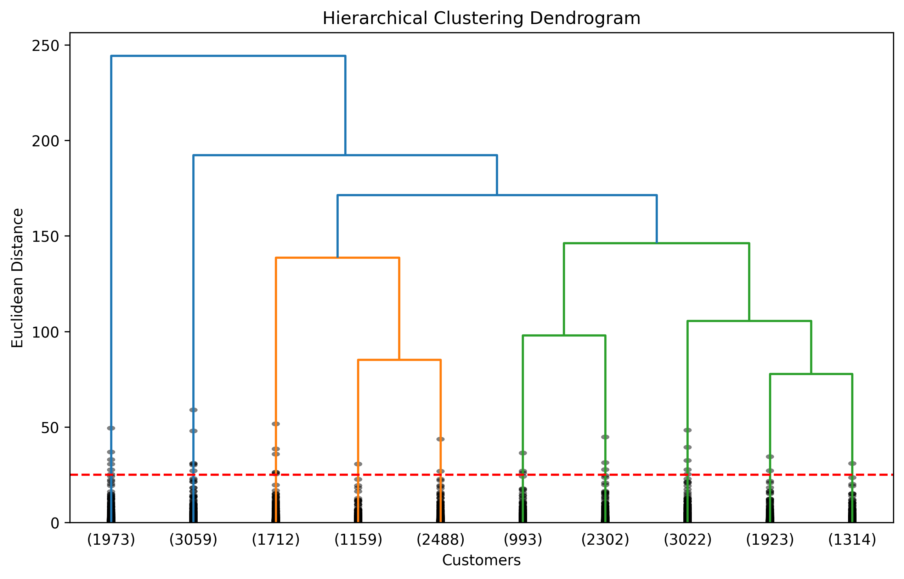

# FLO Customer Segmentation

## Overview
Customer segmentation project using K-Means and Hierarchical Clustering.

## Methods
- K-Means
- Hierarchical Clustering
- Elbow Method
- Silhouette Score

## Visuals

## Key Takeaway

Customer segmentation should not rely solely on statistical metrics.
Business interpretability is equally important when selecting the number of clusters.